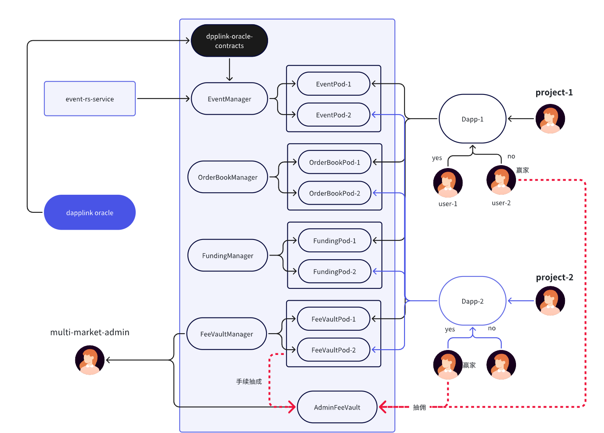

# 去中心化预测市场 BaaS 平台

## 1. 概述
该仓库包含基于 Foundry 的预测市场智能合约实现，采用模块化、Pod 化架构，面向多租户（vendor）部署。核心思想是将事件管理、撮合/持仓、资金结算、费用托管等职责拆分为独立模块，并通过 PodFactory/PodDeployer 进行按需部署与隔离。

每个 vendor 获得完全隔离的 Pod 集合（EventPod、OrderBookPod、FundingPod、FeeVaultPod），实现横向扩展和租户隔离。系统采用 CREATE2 确定性部署，支持多代币、订单簿交易、虚拟 Long Token 系统和 Merkle 证明结算。

## 2. 系统架构

### 2.1 架构层次
```
┌─────────────────────────────────────────────────────┐
│                   PodFactory                        │
│            (Vendor 注册与协调中心)                    │
└──────────────────┬──────────────────────────────────┘
                   │
    ┌──────────────┼──────────────┬──────────────┐
    ▼              ▼              ▼              ▼
EventManager  OrderBookManager FundingManager FeeVaultManager
    │              │              │              │
    └──────────────┴──────────────┴──────────────┘
                   │
              PodDeployer (CREATE2 确定性部署)
                   │
    ┌──────────────┼──────────────┬──────────────┐
    ▼              ▼              ▼              ▼
 EventPod     OrderBookPod    FundingPod    FeeVaultPod
(每个 Vendor 一套独立实例)
```

### 2.2 核心设计原则
- **Vendor 隔离**：每个 vendor 拥有独立 Pod 集合，互不干扰
- **确定性部署**：使用 CREATE2 + vendorId 计算确定的合约地址
- **模块化职责**：事件、订单、资金、费用分离管理
- **可扩展性**：支持多代币（ERC20 + ETH）、多预言机适配器

## 3. 核心模块详解

### 3.1 Pod 合约（租户级）

#### EventPod (`src/event/pod/EventPod.sol`)
**职责**：事件生命周期管理与预言机集成

**核心功能**：
- **事件创建**：vendor 创建事件，定义标题、描述、截止时间、结算时间、结果选项（2-32 个）
- **状态管理**：Created → Active → Settled/Cancelled
- **预言机请求**：`requestOracleResult()` 向预言机请求事件结果
- **结算验证**：接收预言机结果，验证 Merkle 证明后触发 OrderBookPod 结算
- **事件取消**：支持取消未结算事件

**数据结构**：
```solidity
Event {
  uint256 eventId;
  string title;
  string description;
  uint256 deadline;          // 投注截止时间
  uint256 settlementTime;    // 预期结算时间
  EventStatus status;        // 事件状态
  address creator;
  Outcome[] outcomes;        // 结果选项数组
  uint8 winningOutcomeIndex; // 获胜选项索引
}
```

**关键接口**：
- `createEvent()` → 创建事件
- `updateEventStatus()` → 更新状态
- `settleEvent()` → 结算事件（由 OracleAdapter 调用）
- `cancelEvent()` → 取消事件

---

#### OrderBookPod (`src/orderbook/pod/OrderBookPod.sol`)
**职责**：订单簿交易引擎与持仓跟踪

**核心功能**：
- **订单管理**：用户下单（Buy/Sell）、取消订单
- **自动撮合**：买单从最低卖价匹配，卖单从最高买价匹配，FIFO 原则
- **持仓跟踪**：记录每个用户在每个结果选项上的持仓量
- **事件结算**：接收 EventPod 结算通知，取消待成交订单，分配奖金池
- **多代币支持**：每个订单指定交易代币

**数据结构**：
```solidity
Order {
  uint256 orderId;
  address user;
  uint256 eventId;
  uint8 outcomeIndex;        // 结果选项索引
  OrderSide side;            // Buy / Sell
  uint256 price;             // 价格（1-10000 基点）
  uint256 amount;            // 订单总量
  uint256 filledAmount;      // 已成交量
  uint256 remainingAmount;   // 待成交量
  OrderStatus status;        // Pending/Partial/Filled/Cancelled
  address tokenAddress;      // 交易代币
}

OutcomeOrderBook {
  mapping(price => orderId[]) buyOrders;  // 买单（价格降序）
  mapping(price => orderId[]) sellOrders; // 卖单（价格升序）
}
```

**订单撮合逻辑**：
```
买单撮合：遍历最低卖价开始的卖单队列
卖单撮合：遍历最高买价开始的买单队列
成交条件：买价 >= 卖价
成交量：min(买单剩余, 卖单剩余)
持仓更新：买方 +amount, 卖方 -amount
资金结算：调用 FundingPod.settleMatchedOrder()
```

**关键接口**：
- `placeOrder()` → 下单（自动撮合）
- `cancelOrder()` → 取消订单
- `settleEvent()` → 结算事件（由 EventPod 调用）
- `addEvent()` → 注册可交易事件

---

#### FundingPod (`src/funding/pod/FundingPod.sol`)
**职责**：资金管理与虚拟 Long Token 系统

**核心功能**：
- **存取款**：支持 ERC20 和 ETH 存款/提款
- **虚拟 Long Token**：用户可铸造/销毁完整集合（所有结果选项各一份）
- **资金锁定**：为待成交订单锁定资金或 Long Token
- **交易结算**：执行订单撮合后的资金/代币转移
- **奖金池管理**：跟踪每个事件的奖金池，结算时按比例分配给获胜方
- **多代币支持**：每个用户可持有多种代币余额

**虚拟 Long Token 机制**：
```solidity
longPositions[user][token][eventId][outcomeIndex] = amount

// 铸造完整集合：
// - 消耗 amount 代币
// - 获得每个结果选项的 amount Long Token
// - 增加事件奖金池

// 销毁完整集合：
// - 销毁每个结果选项的 amount Long Token
// - 返还 amount 代币
// - 减少事件奖金池
```

**资金流动**：
```
买单：锁定 (amount × price / MAX_PRICE) USDT → 成交后换取 Long Token
卖单：锁定 amount Long Token → 成交后换取 USDT
```

**结算分配**：
```
每个获胜者奖励 = (奖金池总额 × 用户持仓) / 获胜方总持仓
```

**关键接口**：
- `deposit()` / `depositErc20()` / `depositEth()` → 存款
- `withdrawDirect()` → 提款
- `mintCompleteSet()` → 铸造完整集合
- `burnCompleteSet()` → 销毁完整集合
- `lockForOrder()` → 锁定订单资金
- `unlockForOrder()` → 解锁订单资金
- `settleMatchedOrder()` → 结算已撮合订单
- `settleEvent()` → 分配事件奖金

---

#### FeeVaultPod (`src/feevault/pod/FeeVaultPod.sol`)
**职责**：费用收取、计算与金库管理

**核心功能**：
- **费用计算**：基于可配置费率计算交易费用（基点制，10000 = 100%）
- **费用收取**：接收 OrderBookPod 转入的交易费用
- **统计跟踪**：记录每个事件、每个用户的费用统计
- **自动转移**：达到阈值时自动转移到 AdminFeeVault（平台级）
- **手动提取**：owner 可提取累积费用
- **多费用类型**：支持不同费用类型（如 "trade"）

**费用收取点**：
```
1. 下单时：calculateFee(amount, "trade")
   → 从用户余额扣除

2. 撮合时：calculateFee(matchAmount, "trade")
   → 买卖双方各承担 50%
   → 从锁定资金/Long Token 扣除

默认费率：30 基点 (0.3%)
```

**自动转移机制**：
```solidity
if (currentBalance >= transferThreshold[token]) {
  transfer to AdminFeeVault
}
```

**关键接口**：
- `collectFee()` → 收取费用（由 OrderBookPod 调用）
- `calculateFee()` → 计算费用
- `withdrawFee()` → 提取费用
- `setFeeRate()` → 设置费率
- `setTransferThreshold()` → 设置自动转移阈值

---

### 3.2 Manager 合约（协调层）

#### EventManager (`src/event/core/EventManager.sol`)
**职责**：Vendor 注册与 EventPod 部署协调

**核心功能**：
- 注册/注销 vendor（由 PodFactory 调用）
- 为每个 vendor 部署 EventPod（通过 PodDeployer）
- 管理授权预言机列表
- 提供 vendor → EventPod 地址查询

**关键接口**：
- `registerVendor()` → 注册 vendor
- `deployEventPod()` → 部署 EventPod
- `getVendorEventPod()` → 查询 vendor 的 EventPod 地址
- `registerOracle()` / `removeOracle()` → 预言机授权

<<<<<<< HEAD
---
=======
[]
>>>>>>> f11b957c12a4e94a6979a346cc5088c02356e143

#### OrderBookManager (`src/orderbook/core/OrderBookManager.sol`)
**职责**：OrderBookPod 部署与授权管理

**核心功能**：
- 为每个 vendor 部署 OrderBookPod
- 管理授权调用者
- 提供 vendor → OrderBookPod 地址查询

**关键接口**：
- `deployOrderBookPod()` → 部署 OrderBookPod
- `getVendorOrderBookPod()` → 查询 vendor 的 OrderBookPod 地址
- `addAuthorizedCaller()` → 添加授权调用者

---

#### FundingManager (`src/funding/core/FundingManager.sol`)
**职责**：FundingPod 部署与资金查询

**核心功能**：
- 为每个 vendor 部署 FundingPod
- 提供余额、持仓、奖金池查询接口

**关键接口**：
- `deployFundingPod()` → 部署 FundingPod
- `getVendorFundingPod()` → 查询 vendor 的 FundingPod 地址
- `getUserBalance()` → 查询用户余额
- `getUserLongPosition()` → 查询用户 Long Token 持仓

---

#### FeeVaultManager (`src/feevault/core/FeeVaultManager.sol`)
**职责**：FeeVaultPod 部署与费用查询

**核心功能**：
- 为每个 vendor 部署 FeeVaultPod
- 提供费用余额查询

**关键接口**：
- `deployFeeVaultPod()` → 部署 FeeVaultPod
- `getVendorFeeVaultPod()` → 查询 vendor 的 FeeVaultPod 地址
- `getVendorPodFeeBalance()` → 查询 vendor 的费用余额

---

### 3.3 工厂合约（部署层）

#### PodFactory (`src/event/factory/PodFactory.sol`)
**职责**：中心化 vendor 注册与 Pod 生命周期管理

**核心功能**：
- **Vendor 注册**：为新 vendor 分配唯一 vendorId，预计算 Pod 地址
- **协调部署**：依次调用 4 个 Manager 部署对应 Pod
- **地址验证**：确保实际部署地址与预计算地址一致（CREATE2 保证）
- **状态管理**：激活/停用 vendor

**注册流程**：
```
1. registerVendor(vendorAddress, feeRecipient)
2. 分配 vendorId（从 1 递增）
3. 预计算 4 个 Pod 地址（CREATE2）
4. 调用 EventManager.deployEventPod()
5. 调用 OrderBookManager.deployOrderBookPod()
6. 调用 FundingManager.deployFundingPod()
7. 调用 FeeVaultManager.deployFeeVaultPod()
8. 验证地址匹配
9. 存储 VendorInfo 结构
```

**数据结构**：
```solidity
VendorInfo {
  uint256 vendorId;
  address vendorAddress;
  address feeRecipient;
  bool isActive;
  VendorPodSet {
    address eventPod;
    address orderBookPod;
    address feeVaultPod;
    address fundingPod;
  }
}
```

**关键接口**：
- `registerVendor()` → 注册 vendor
- `setVendorActive()` → 激活/停用 vendor
- `getVendorInfo()` → 查询 vendor 信息

---

#### PodDeployer (`src/event/factory/PodDeployer.sol`)
**职责**：使用 CREATE2 确定性部署 Pod 实例

**核心功能**：
- 存储各 Pod 类型的实现合约地址
- 使用 CREATE2 + 确定性 salt 部署 Pod
- 初始化部署的 Pod 合约

**Salt 计算**：
```solidity
salt = keccak256(abi.encodePacked(vendorId, podType))
podAddress = Clones.cloneDeterministic(implementation, salt)
```

**关键接口**：
- `deployEventPod()` → 部署 EventPod
- `deployOrderBookPod()` → 部署 OrderBookPod
- `deployFundingPod()` → 部署 FundingPod
- `deployFeeVaultPod()` → 部署 FeeVaultPod

---

### 3.4 预言机系统

#### OracleManager (`src/oracle/OracleManager.sol`)
**职责**：预言机生命周期与适配器管理

**核心功能**：
- 注册/移除预言机适配器
- 授权预言机到适配器
- 设置默认适配器
- 跟踪活跃适配器

**多适配器支持**：
- 支持多个预言机适配器
- 每个预言机可授权给多个适配器
- 默认适配器提供回退机制

**关键接口**：
- `registerAdapter()` → 注册适配器
- `removeAdapter()` → 移除适配器
- `authorizeOracle()` → 授权预言机
- `setDefaultAdapter()` → 设置默认适配器

---

#### OracleAdapter (接口)
**职责**：预言机数据接入与验证

**核心功能**：
- 接收预言机提交的事件结果
- 验证 Merkle 证明
- 回调 EventPod.settleEvent()

**预言机流程**：
```
1. Vendor → EventPod.requestOracleResult(eventId)
   - 存储预言机请求

2. Oracle → OracleAdapter.fulfillResult(eventId, winningOutcomeIndex, proof)
   - 预言机提交结果 + Merkle 证明

3. OracleAdapter → EventPod.settleEvent(eventId, winningOutcomeIndex, proof)
   - 适配器调用事件结算

4. EventPod 验证 Merkle 证明
   - 验证通过 → 更新事件状态 → 触发 OrderBookPod 结算
```

---

### 3.5 平台级合约

#### AdminFeeVault (`src/admin/AdminFeeVault.sol`)
**职责**：平台级费用汇总与管理

**核心功能**：
- 接收所有 FeeVaultPod 的自动转移费用
- 平台管理员提取累积费用
- 多代币支持

**关键接口**：
- `collectAdminFee()` → 接收费用（由 FeeVaultPod 调用）
- `withdrawAdminFee()` → 提取平台费用

## 4. 业务逻辑流程

### 4.1 完整事件生命周期

#### 阶段 1：事件创建与激活
```
1. Vendor → EventPod.createEvent(title, description, deadline, settlementTime, outcomes)
   └─ 创建事件，分配唯一 eventId，状态 = Created

2. Vendor → EventPod.updateEventStatus(eventId, Active)
   └─ 状态转换为 Active（开始可交易）

3. OrderBookPod.addEvent(eventId, outcomeCount)
   ├─ 在订单簿中注册事件
   └─ 在 FundingPod 中注册结果选项
```

#### 阶段 2：用户交易

**2.1 资金存入**
```
User → FundingPod.depositErc20(token, amount)
└─ 存入交易资金
```

**2.2 铸造完整集合（可选）**
```
User → FundingPod.mintCompleteSet(eventId, token, amount)
├─ 消耗 amount 代币
├─ 获得每个结果选项的 amount Long Token
└─ 增加事件奖金池
```

**2.3 下单交易**
```
User → OrderBookPod.placeOrder(eventId, outcomeIndex, Buy/Sell, price, amount, token)
│
├─ 步骤 1：资金锁定
│   ├─ 买单：锁定 (amount × price / MAX_PRICE) 代币
│   └─ 卖单：锁定 amount Long Token
│   └─ FundingPod.lockForOrder()
│
├─ 步骤 2：收取下单费用
│   └─ FeeVaultPod.collectFee(user, amount × feeRate)
│
├─ 步骤 3：订单撮合（自动）
│   ├─ 买单：从最低卖价开始匹配
│   ├─ 卖单：从最高买价开始匹配
│   └─ OrderBookPod._matchOrder() → _executeMatch()
│       │
│       ├─ 计算成交量 = min(买单剩余, 卖单剩余)
│       │
│       ├─ 更新持仓：
│       │   ├─ positions[eventId][outcome][buyer] += matchAmount
│       │   └─ positions[eventId][outcome][seller] -= matchAmount
│       │
│       ├─ 结算资金/代币：
│       │   └─ FundingPod.settleMatchedOrder()
│       │       ├─ 买方：消耗锁定代币 → 获得 Long Token
│       │       └─ 卖方：消耗锁定 Long Token → 获得代币
│       │
│       └─ 收取成交费用（买卖各 50%）：
│           └─ FeeVaultPod.collectFee()
│
└─ 步骤 4：订单入簿（未完全成交）
    └─ 添加到对应价格队列
```

**2.4 取消订单（可选）**
```
User → OrderBookPod.cancelOrder(orderId)
└─ FundingPod.unlockForOrder()
    └─ 释放锁定资金/Long Token
```

**2.5 销毁完整集合（可选）**
```
User → FundingPod.burnCompleteSet(eventId, token, amount)
├─ 销毁每个结果选项的 amount Long Token
├─ 返还 amount 代币
└─ 减少事件奖金池
```

#### 阶段 3：事件结算

**3.1 请求预言机**
```
Vendor → EventPod.requestOracleResult(eventId)
└─ 存储预言机请求记录
```

**3.2 预言机提交结果**
```
Oracle → OracleAdapter.fulfillResult(eventId, winningOutcomeIndex, merkleProof)
└─ 调用 EventPod.settleEvent(eventId, winningOutcomeIndex, merkleProof)
```

**3.3 事件结算**
```
EventPod._settleEvent()
│
├─ 验证 Merkle 证明
├─ 更新事件状态 = Settled
└─ 调用 OrderBookPod.settleEvent(eventId, winningOutcomeIndex)
    │
    ├─ 标记事件已结算
    │
    ├─ 取消所有待成交订单
    │   └─ FundingPod.unlockForOrder() 释放资金
    │
    └─ 结算持仓，分配奖金
        └─ FundingPod.settleEvent(winners[], positions[])
            │
            └─ 对每个获胜者：
                reward = (prizePool × userPosition) / totalWinningPositions
                └─ 增加用户可用余额
```

**3.4 提取奖金**
```
User → FundingPod.withdrawDirect(token, amount)
└─ 提取获胜奖金或剩余余额
```

---

### 4.2 订单撮合详细流程

#### 撮合引擎逻辑
```solidity
placeOrder(eventId, outcomeIndex, Buy, price, amount, token):

A. 资金锁定
   requiredAmount = (amount × price) / MAX_PRICE
   FundingPod.lockForOrder(user, token, requiredAmount)

B. 收取下单费用
   fee = amount × feeRate / 10000
   FeeVaultPod.collectFee(user, fee, "trade")

C. 撮合循环（买单示例）
   currentPrice = lowestSellPrice

   while (remainingAmount > 0 && currentPrice <= buyPrice):
     sellOrders = orderBook.sellOrders[currentPrice]

     for each sellOrder in sellOrders:
       matchAmount = min(buyOrder.remaining, sellOrder.remaining)

       // 更新订单
       buyOrder.filledAmount += matchAmount
       sellOrder.filledAmount += matchAmount
       buyOrder.remainingAmount -= matchAmount
       sellOrder.remainingAmount -= matchAmount

       // 更新持仓
       positions[eventId][outcomeIndex][buyer] += matchAmount
       positions[eventId][outcomeIndex][seller] -= matchAmount

       // 结算资金
       FundingPod.settleMatchedOrder(
         buyer, seller,
         (matchAmount × sellPrice) / MAX_PRICE,  // USDT 金额
         matchAmount,                             // Long Token 数量
         token
       )

       // 收取成交费用（各 50%）
       buyerFee = matchAmount × feeRate / 20000
       sellerFee = matchAmount × feeRate / 20000
       FeeVaultPod.collectFee(buyer, buyerFee)
       FeeVaultPod.collectFee(seller, sellerFee)

       // 更新订单状态
       if (sellOrder.remaining == 0):
         sellOrder.status = Filled
         remove from orderBook

       if (buyOrder.remaining == 0):
         break outer loop

     currentPrice = nextHigherSellPrice

D. 入簿（如有剩余）
   if (buyOrder.remainingAmount > 0):
     buyOrder.status = Partial (or Pending)
     add to orderBook.buyOrders[buyPrice]
   else:
     buyOrder.status = Filled
```

#### 订单簿数据结构
```
OutcomeOrderBook {
  // 买单：价格降序（最高买价优先）
  buyOrders: {
    10000: [orderId1, orderId2, ...]
    9500:  [orderId3, orderId4, ...]
    9000:  [orderId5, ...]
  }

  // 卖单：价格升序（最低卖价优先）
  sellOrders: {
    5000:  [orderId6, orderId7, ...]
    5500:  [orderId8, ...]
    6000:  [orderId9, orderId10, ...]
  }
}

// 价格范围：1 - 10000（基点）
// 10000 = 100% = 1.0 USDT per Long Token
```

---

### 4.3 虚拟 Long Token 系统

#### 完整集合机制
```
假设事件有 3 个结果选项：A, B, C

铸造完整集合（用户支付 100 USDT）：
  ├─ longPositions[user][USDT][eventId][A] += 100
  ├─ longPositions[user][USDT][eventId][B] += 100
  ├─ longPositions[user][USDT][eventId][C] += 100
  └─ eventPrizePool[eventId][USDT] += 100

销毁完整集合（用户持有各 100 Long Token）：
  ├─ longPositions[user][USDT][eventId][A] -= 100
  ├─ longPositions[user][USDT][eventId][B] -= 100
  ├─ longPositions[user][USDT][eventId][C] -= 100
  ├─ eventPrizePool[eventId][USDT] -= 100
  └─ 返还 100 USDT
```

#### Long Token 流动
```
买单成交：
  ├─ 消耗锁定的 USDT
  └─ 获得 Long Token（增加 longPositions）

卖单成交：
  ├─ 消耗锁定的 Long Token（减少 longPositions）
  └─ 获得 USDT

结算分配：
  ├─ 只有获胜选项的 Long Token 持有者获得奖励
  └─ 奖励 = (奖金池 × 用户 Long Token) / 所有获胜者 Long Token 总和
```

---

### 4.4 费用收取机制

#### 费用收取点
```
1. 下单时：
   fee = orderAmount × feeRate / 10000
   └─ 从用户余额扣除

2. 撮合时（买卖双方各承担 50%）：
   buyerFee = matchAmount × feeRate / 20000
   sellerFee = matchAmount × feeRate / 20000
   └─ 从锁定资金/Long Token 扣除

默认费率：30 基点 (0.3%)
```

#### 费用流转
```
User 交易费用
  ↓
FeeVaultPod（vendor 级）
  ↓ (达到阈值自动转移)
AdminFeeVault（平台级）
  ↓ (平台管理员提取)
Platform Treasury
```

---

### 4.5 数据模型总结

#### 持仓模型
```
OrderBookPod 持仓：
  positions[eventId][outcomeIndex][user] = amount
  └─ 跟踪用户在每个结果选项上的"简单"持仓

FundingPod 持仓：
  longPositions[user][token][eventId][outcomeIndex] = amount
  └─ 跟踪用户持有的虚拟 Long Token 数量

关系：
  OrderBookPod 持仓 ≈ FundingPod Long Token 持仓
  (通过订单撮合和完整集合操作保持同步)
```

#### 奖金池模型
```
eventPrizePool[eventId][token] = totalAmount

增加来源：
  └─ mintCompleteSet() 铸造完整集合

减少来源：
  └─ burnCompleteSet() 销毁完整集合

分配方式（结算时）：
  对每个获胜者：
    reward = (prizePool × userLongPosition) / totalWinningLongPositions
    └─ 增加到 userBalances[user][token]
```

#### 事件状态机
```
Created (初始状态)
  ↓ updateEventStatus()
Active (可交易)
  ↓ settleEvent() 或 cancelEvent()
Settled / Cancelled (终态)
```

---

## 5. 项目结构
```
src/
  admin/          AdminFeeVault.sol - 平台级费用汇总
  event/
    core/         EventManager.sol - 事件管理协调
    factory/      PodFactory.sol, PodDeployer.sol - 工厂与部署
    pod/          EventPod.sol - 事件 Pod 实现
  orderbook/
    core/         OrderBookManager.sol - 订单簿管理协调
    pod/          OrderBookPod.sol - 订单簿 Pod 实现
  funding/
    core/         FundingManager.sol - 资金管理协调
    pod/          FundingPod.sol - 资金 Pod 实现
  feevault/
    core/         FeeVaultManager.sol - 费用管理协调
    pod/          FeeVaultPod.sol - 费用 Pod 实现
  oracle/         OracleManager.sol, OracleAdapter - 预言机系统
  interfaces/     各模块接口定义
  utils/          工具合约（如 Errors, Events）

test/             Foundry 测试（*.t.sol）
script/           部署脚本
assets/           架构图等资源
```

## 6. 关键技术特性

### 6.1 CREATE2 确定性部署
- 使用 `keccak256(abi.encodePacked(vendorId, podType))` 作为 salt
- 部署前可预计算所有 Pod 地址
- 避免循环依赖问题
- 支持前端/后端提前知晓地址

### 6.2 Vendor 隔离架构
- 每个 vendor 拥有独立的 4 个 Pod 实例
- Pod 之间完全隔离，互不影响
- 支持横向扩展，新增 vendor 不影响现有系统
- 租户级权限控制

### 6.3 订单簿交易模型
- 中心化订单簿 + 去中心化结算
- 价格-时间优先（Price-Time Priority）
- 自动撮合引擎
- 支持部分成交
- FIFO 队列保证公平性

### 6.4 虚拟 Long Token 系统
- 无需部署实际 ERC20 代币
- 铸造/销毁完整集合提供流动性
- 奖金池累积与分配机制
- 支持多代币（任意 ERC20 + ETH）

### 6.5 安全特性
- Merkle 证明验证预言机结果
- 重入攻击防护（ReentrancyGuard）
- 可暂停合约（Pausable）
- 可升级合约（UUPS Proxy）
- 权限控制（Ownable / AccessControl）

### 6.6 Gas 优化
- 使用 Clones.cloneDeterministic() 减少部署成本
- 订单簿使用 mapping + 价格队列优化查询
- 批量操作支持（如批量取消订单）
- 事件索引优化

## 7. 开发与测试

### 基础命令
```bash
forge build                      # 编译合约
forge test                       # 运行所有测试
forge test --match-test <name>   # 运行指定测试
forge test -vvv                  # 详细输出（包括堆栈跟踪）
forge fmt                        # 格式化代码
forge snapshot                   # 生成 gas 快照
forge coverage                   # 测试覆盖率
```

### 本地开发
```bash
make anvil                       # 启动本地 Anvil 链（8545 端口）
```

### 依赖管理
```bash
forge install                    # 安装 Foundry 依赖
forge update                     # 更新依赖
```

### 测试分类
```
test/
  PodFactory.t.sol              # 工厂合约测试
  EventManager.t.sol            # 事件管理测试
  OrderBookPod.t.sol            # 订单簿测试
  FundingPod.t.sol              # 资金管理测试
  FeeVaultPod.t.sol             # 费用测试
  integration/                  # 集成测试
    CompleteFlow.t.sol          # 完整业务流程测试
```

## 8. 部署

### 环境配置
创建 `.env` 文件并配置以下变量：
```bash
# 私钥
PRIVATE_KEY=your_private_key

# RPC 端点
SEPOLIA_RPC_URL=https://sepolia.infura.io/v3/YOUR_KEY
ROOTHASH_RPC_URL=https://rpc.roothash.network

# Etherscan API（用于合约验证）
ETHERSCAN_API_KEY=your_etherscan_api_key
```

### 部署命令
Makefile 已提供常用部署目标：
```bash
make deploy-local               # 部署到本地 Anvil
make deploy-sepolia             # 部署到 Sepolia 测试网
make deploy-roothash            # 部署到 Roothash 网络
```

### 部署流程
```
1. 部署 AdminFeeVault（平台级费用金库）
2. 部署 OracleManager（预言机管理）
3. 部署 PodDeployer（Pod 部署器）
4. 部署 4 个 Manager（Event, OrderBook, Funding, FeeVault）
5. 部署 PodFactory（工厂合约）
6. 初始化配置（设置地址、权限等）
7. 注册第一个 Vendor（可选）
```

### 自定义部署脚本
当前部署脚本引用 `script/DeploySWToken.s.sol`，如需使用其他脚本请同步更新 Makefile。

部署脚本模板：
```solidity
// script/Deploy.s.sol
contract DeployScript is Script {
    function run() external {
        uint256 deployerPrivateKey = vm.envUint("PRIVATE_KEY");
        vm.startBroadcast(deployerPrivateKey);

        // 1. 部署核心合约
        AdminFeeVault adminFeeVault = new AdminFeeVault();
        OracleManager oracleManager = new OracleManager();
        PodDeployer podDeployer = new PodDeployer();

        // 2. 部署 Managers
        EventManager eventManager = new EventManager(address(podDeployer));
        OrderBookManager orderBookManager = new OrderBookManager(address(podDeployer));
        FundingManager fundingManager = new FundingManager(address(podDeployer));
        FeeVaultManager feeVaultManager = new FeeVaultManager(address(podDeployer));

        // 3. 部署 PodFactory
        PodFactory podFactory = new PodFactory(
            address(eventManager),
            address(orderBookManager),
            address(fundingManager),
            address(feeVaultManager)
        );

        // 4. 配置权限
        eventManager.setPodFactory(address(podFactory));
        orderBookManager.setPodFactory(address(podFactory));
        fundingManager.setPodFactory(address(podFactory));
        feeVaultManager.setPodFactory(address(podFactory));

        vm.stopBroadcast();

        console.log("AdminFeeVault:", address(adminFeeVault));
        console.log("PodFactory:", address(podFactory));
    }
}
```

## 9. 使用指南

### 9.1 作为平台管理员

**注册新 Vendor**
```solidity
// 1. 调用 PodFactory.registerVendor()
podFactory.registerVendor(
    vendorAddress,    // Vendor 地址
    feeRecipient      // 费用接收地址
);

// 2. 系统自动部署 4 个 Pod 实例
// 3. 获取 Vendor 信息
VendorInfo memory info = podFactory.getVendorInfo(vendorAddress);
console.log("EventPod:", info.podSet.eventPod);
console.log("OrderBookPod:", info.podSet.orderBookPod);
console.log("FundingPod:", info.podSet.fundingPod);
console.log("FeeVaultPod:", info.podSet.feeVaultPod);
```

**管理预言机**
```solidity
// 注册预言机适配器
oracleManager.registerAdapter(adapterAddress);

// 授权预言机
oracleManager.authorizeOracle(oracleAddress, adapterAddress);
```

---

### 9.2 作为 Vendor

**创建事件**
```solidity
// 1. 获取自己的 EventPod
address eventPodAddress = podFactory.getVendorInfo(msg.sender).podSet.eventPod;
IEventPod eventPod = IEventPod(eventPodAddress);

// 2. 准备结果选项
string[] memory outcomes = new string[](3);
outcomes[0] = "Option A";
outcomes[1] = "Option B";
outcomes[2] = "Option C";

// 3. 创建事件
uint256 eventId = eventPod.createEvent(
    "Who will win the election?",      // title
    "2024 Presidential Election",      // description
    block.timestamp + 7 days,          // deadline（投注截止）
    block.timestamp + 14 days,         // settlementTime（结算时间）
    outcomes                           // 结果选项
);

// 4. 激活事件
eventPod.updateEventStatus(eventId, EventStatus.Active);

// 5. 注册到订单簿
address orderBookPodAddress = podFactory.getVendorInfo(msg.sender).podSet.orderBookPod;
IOrderBookPod(orderBookPodAddress).addEvent(eventId, outcomes.length);
```

**请求结算**
```solidity
// 事件截止后，请求预言机结果
eventPod.requestOracleResult(eventId);

// 预言机提交结果后，系统自动结算
```

---

### 9.3 作为用户（交易者）

**存入资金**
```solidity
// 假设使用 USDT
IERC20 usdt = IERC20(usdtAddress);

// 1. 授权
usdt.approve(fundingPodAddress, amount);

// 2. 存款
IFundingPod(fundingPodAddress).depositErc20(usdtAddress, amount);
```

**铸造完整集合**
```solidity
// 用 100 USDT 铸造完整集合（获得每个结果选项各 100 Long Token）
fundingPod.mintCompleteSet(eventId, usdtAddress, 100 ether);
```

**下买单**
```solidity
// 买入结果选项 0，价格 6000（0.6 USDT），数量 100
orderBookPod.placeOrder(
    eventId,
    0,                      // outcomeIndex
    OrderSide.Buy,
    6000,                   // price（基点）
    100 ether,              // amount
    usdtAddress             // token
);

// 系统自动撮合，如有匹配的卖单立即成交
```

**下卖单**
```solidity
// 卖出结果选项 0，价格 6500（0.65 USDT），数量 50
orderBookPod.placeOrder(
    eventId,
    0,                      // outcomeIndex
    OrderSide.Sell,
    6500,                   // price
    50 ether,               // amount
    usdtAddress
);
```

**取消订单**
```solidity
// 取消待成交订单
orderBookPod.cancelOrder(orderId);
```

**查询持仓**
```solidity
// 查询在结果选项 0 上的持仓
uint256 position = orderBookPod.positions(eventId, 0, userAddress);

// 查询 Long Token 持仓
uint256 longPosition = fundingPod.longPositions(
    userAddress,
    usdtAddress,
    eventId,
    0  // outcomeIndex
);
```

**提取资金（结算后）**
```solidity
// 查询可用余额
uint256 balance = fundingPod.userBalances(userAddress, usdtAddress);

// 提取
fundingPod.withdrawDirect(usdtAddress, balance);
```

---

## 10. 相关文档
- `ADMIN_FEE_VAULT_INTEGRATION.md` - 平台级费用金库集成指南
- `VIRTUAL_LONG_TOKEN_GUIDE.md` - 虚拟 Long Token 系统详解
- `final_checklist.md` - 部署前检查清单
- `AGENTS.md` - 代理系统说明

## 11. 架构优势

### 模块化设计
- 职责清晰分离：事件、订单、资金、费用各司其职
- 易于维护和升级
- 可独立测试各模块

### 租户隔离
- 每个 vendor 独立 Pod 集合
- 故障隔离：单个 vendor 问题不影响其他
- 灵活定制：可为不同 vendor 配置不同参数

### 可扩展性
- 水平扩展：随时添加新 vendor
- 支持多代币：任意 ERC20 + ETH
- 支持多预言机：可接入多个数据源

### 安全性
- Merkle 证明验证
- 重入攻击防护
- 权限控制
- 可暂停与可升级

### 经济模型
- 订单簿提供价格发现
- 完整集合机制提供流动性
- 奖金池模型激励参与
- 费用机制可持续运营

## 12. 未来规划

### 功能扩展
- [ ] 支持条件订单（止损/止盈）
- [ ] 限价单有效期（GTC/IOC/FOK）
- [ ] 批量操作接口
- [ ] 事件组合与多事件关联
- [ ] AMM 流动性池集成

### 性能优化
- [ ] Gas 优化：批量处理、存储优化
- [ ] Layer 2 部署支持
- [ ] 链下订单簿 + 链上结算混合模式

### 生态集成
- [ ] 前端 SDK
- [ ] GraphQL 索引服务
- [ ] 移动端适配
- [ ] 第三方预言机集成（Chainlink, UMA 等）

## 13. 许可证
MIT License

## 14. 注意事项

1. **安全提醒**：本系统处于开发阶段，请勿在主网使用未经审计的代码
2. **审计要求**：部署前务必进行全面的安全审计
3. **测试优先**：建议先在测试网充分测试
4. **Gas 管理**：注意 gas 成本，批量操作可降低费用
5. **数据备份**：定期备份关键配置和状态数据

## 15. 联系方式
- GitHub Issues: [提交问题](https://github.com/your-repo/issues)
- 文档: [查看完整文档](https://docs.your-project.com)
