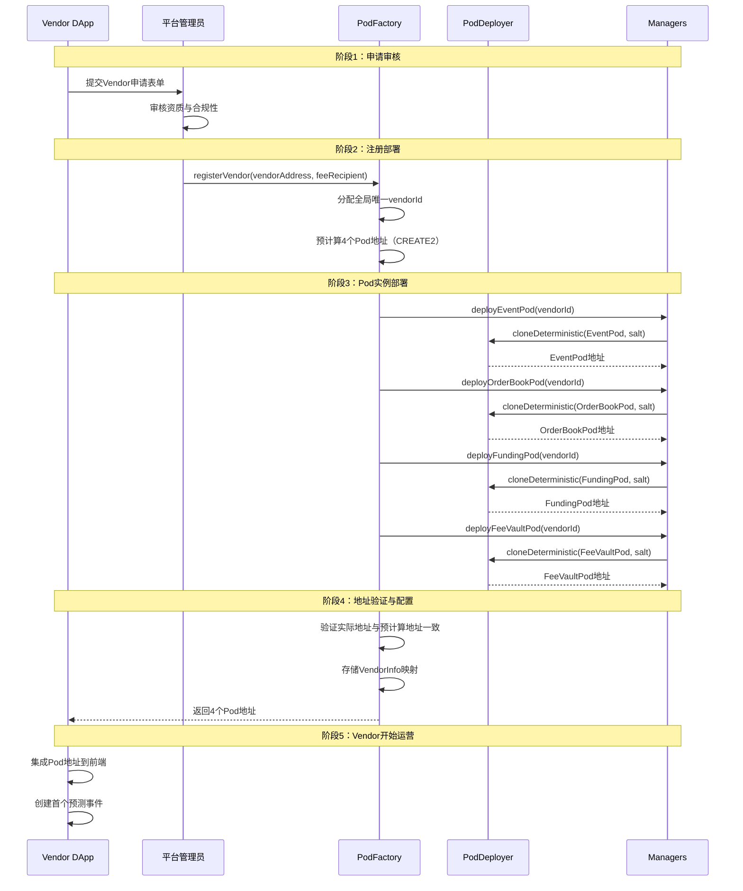
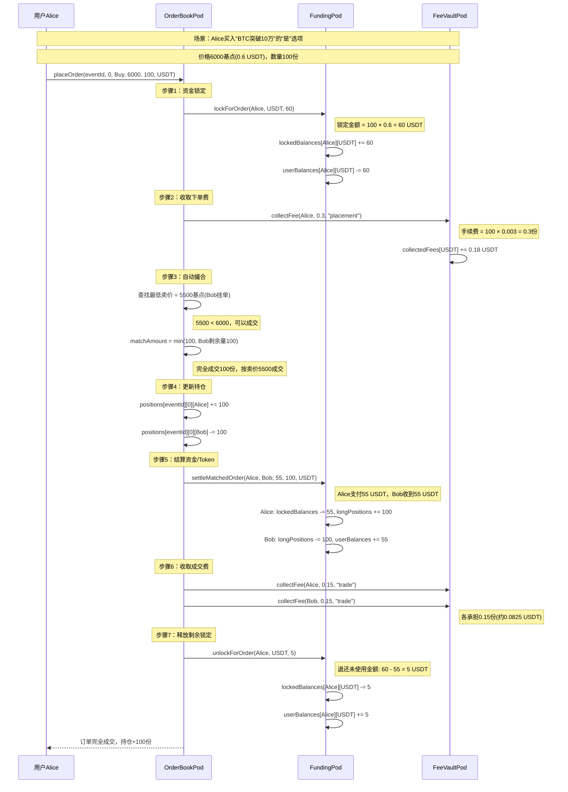
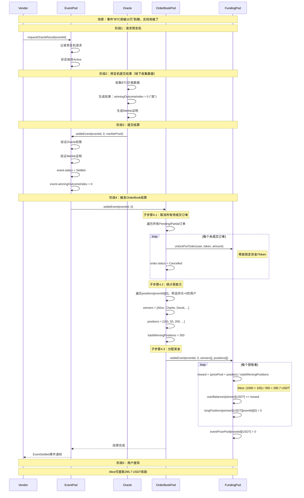
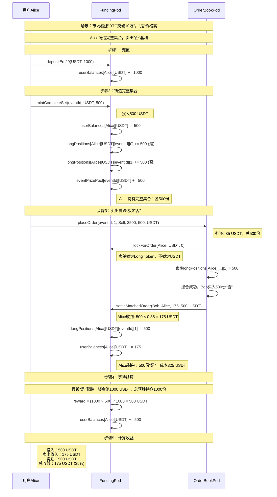

# 去中心化预测市场 BaaS 平台 - 合约设计说明文档

## 1. 整体架构设计

### 1.1 系统分层架构

```
┌─────────────────────────────────────────────────────────────┐
│                      Factory Layer 工厂层                    │
│  ┌──────────────┐          ┌─────────────────────────┐      │
│  │  PodFactory  │────────→│     PodDeployer         │      │
│  │  (注册中心)   │          │   (CREATE2 部署器)       │      │
│  └──────────────┘          └─────────────────────────┘      │
└────────────────────────┬────────────────────────────────────┘
                         │
         ┌───────────────┼────────────────┬──────────┐
         ↓               ↓                ↓          ↓
┌─────────────────────────────────────────────────────────────┐
│                    Manager Layer 管理层                      │
│  ┌──────────┐ ┌──────────────┐ ┌──────────┐ ┌────────────┐ │
│  │  Event   │ │  OrderBook   │ │ Funding  │ │ FeeVault   │ │
│  │ Manager  │ │   Manager    │ │ Manager  │ │  Manager   │ │
│  └──────────┘ └──────────────┘ └──────────┘ └────────────┘ │
└────────────────────────┬────────────────────────────────────┘
                         │
         ┌───────────────┼────────────────┬──────────┐
         ↓               ↓                ↓          ↓
┌─────────────────────────────────────────────────────────────┐
│                  Pod Instance Layer Pod实例层                │
│                                                               │
│  Vendor A:                      Vendor B:                    │
│  ┌──────────┐ ┌──────────┐     ┌──────────┐ ┌──────────┐   │
│  │ EventPod │ │OrderBook │     │ EventPod │ │OrderBook │   │
│  │          │ │   Pod    │     │          │ │   Pod    │   │
│  └──────────┘ └──────────┘     └──────────┘ └──────────┘   │
│  ┌──────────┐ ┌──────────┐     ┌──────────┐ ┌──────────┐   │
│  │ Funding  │ │ FeeVault │     │ Funding  │ │ FeeVault │   │
│  │   Pod    │ │   Pod    │     │   Pod    │ │   Pod    │   │
│  └──────────┘ └──────────┘     └──────────┘ └──────────┘   │
│                                                               │
│  ✓ 每个Vendor独立的4个Pod实例                                 │
│  ✓ 完全隔离，互不影响                                         │
└─────────────────────────────────────────────────────────────┘
         │                                  │
         ↓                                  ↓
┌──────────────────┐            ┌─────────────────────┐
│ AdminFeeVault    │            │  OracleManager &    │
│  (平台费用金库)   │            │   OracleAdapter     │
└──────────────────┘            └─────────────────────┘
```

### 1.2 架构设计理念

#### 1.2.1 三层职责分离

**Factory Layer（工厂层）**
- **职责**：Vendor 注册、Pod 实例生命周期管理
- **核心合约**：PodFactory（协调中心）、PodDeployer（CREATE2 部署）
- **关键特性**：确定性地址预计算、原子化部署

**Manager Layer（管理层）**
- **职责**：各业务模块协调、Pod 实例管理、权限控制
- **核心合约**：EventManager、OrderBookManager、FundingManager、FeeVaultManager
- **关键特性**：无状态协调、统一查询接口

**Pod Instance Layer（Pod 实例层）**
- **职责**：具体业务逻辑实现、数据存储
- **核心合约**：EventPod、OrderBookPod、FundingPod、FeeVaultPod
- **关键特性**：租户隔离、独立升级

#### 1.2.2 CREATE2 确定性部署

```solidity
// 地址预计算公式
salt = keccak256(abi.encodePacked(vendorId, "EventPod"));
predictedAddress = computeCreate2Address(
    implementation,
    salt,
    deployer
);

// 优势：
// 1. 前端可在部署前预知所有合约地址
// 2. 避免循环依赖问题
// 3. 支持跨链部署相同地址
```

---

## 2. 功能模块设计

### 2.1 事件管理模块 (Event Module)

#### 2.1.1 核心数据结构

```solidity
struct Event {
    uint256 eventId;              // 全局唯一事件ID
    string title;                 // 事件标题："BTC是否突破10万美元"
    string description;           // 事件描述
    uint256 deadline;             // 投注截止时间戳
    uint256 settlementTime;       // 预计结算时间戳
    EventStatus status;           // Created/Active/Settled/Cancelled
    address creator;              // 事件创建者（Vendor地址）
    Outcome[] outcomes;           // 结果选项数组（2-32个）
    uint8 winningOutcomeIndex;    // 获胜选项索引（结算后）
}

struct Outcome {
    string name;                  // 选项名称："是" / "否"
    uint256 totalVolume;          // 该选项总交易量
}

enum EventStatus {
    Created,    // 已创建，尚未激活
    Active,     // 激活中，可交易
    Settled,    // 已结算
    Cancelled   // 已取消
}
```

#### 2.1.2 状态机流转

```
[Created] ──updateEventStatus(Active)──→ [Active]
    │                                       │
    │                                       │
cancelEvent()                       settleEvent() / cancelEvent()
    │                                       │
    ↓                                       ↓
[Cancelled]                             [Settled] / [Cancelled]
```

#### 2.1.3 核心函数

| 函数 | 权限 | 功能描述 | Gas估算 |
|------|------|---------|--------|
| `createEvent()` | Vendor | 创建新事件，分配eventId | ~150k |
| `updateEventStatus()` | Vendor | 更新事件状态（激活/取消） | ~50k |
| `requestOracleResult()` | Vendor | 请求预言机提供结算结果 | ~80k |
| `settleEvent()` | Oracle | 提交结果并触发结算 | ~200k |
| `getEvent()` | Public | 查询事件详情 | view |

---

### 2.2 订单簿模块 (OrderBook Module)

#### 2.2.1 核心数据结构

```solidity
struct Order {
    uint256 orderId;              // 全局唯一订单ID
    address user;                 // 下单用户地址
    uint256 eventId;              // 关联的事件ID
    uint8 outcomeIndex;           // 结果选项索引（0-31）
    OrderSide side;               // Buy(买) / Sell(卖)
    uint256 price;                // 价格（基点：1-10000，即0.01%-100%）
    uint256 amount;               // 订单总量
    uint256 filledAmount;         // 已成交量
    uint256 remainingAmount;      // 待成交量
    OrderStatus status;           // Pending/Partial/Filled/Cancelled
    address tokenAddress;         // 交易代币（USDT/USDC/ETH）
    uint256 timestamp;            // 下单时间戳
}

// 订单簿结构（每个事件的每个选项维护独立订单簿）
struct OutcomeOrderBook {
    uint256[] buyPrices;          // 买单价格数组（降序排列）
    uint256[] sellPrices;         // 卖单价格数组（升序排列）
    mapping(uint256 => uint256[]) buyOrders;  // 价格 => 订单ID数组
    mapping(uint256 => uint256[]) sellOrders; // 价格 => 订单ID数组
}

enum OrderSide { Sell, Buy }
enum OrderStatus { Pending, Partial, Filled, Cancelled }
```

#### 2.2.2 订单簿设计

```
买单队列（降序）          卖单队列（升序）
Price | Orders          Price | Orders
------|-------          ------|-------
6500  | [O1, O2]        6800  | [O5, O6]  ← 最低卖价（卖方挂单）
6300  | [O3]            7000  | [O7]
6000  | [O4]            7200  | [O8, O9]
  ↑
最高买价（买方挂单）

撮合规则：
- 买单从最低卖价(6800)开始匹配
- 卖单从最高买价(6500)开始匹配
- 同一价格内按FIFO（先进先出）原则
```

#### 2.2.3 核心函数

| 函数 | 权限 | 功能描述 | Gas估算 |
|------|------|---------|--------|
| `placeOrder()` | User | 下单并自动撮合 | ~150k-300k |
| `cancelOrder()` | User | 取消待成交订单 | ~80k |
| `settleEvent()` | EventPod | 结算事件（取消所有待成交订单） | ~100k+N×20k |
| `getOrderBook()` | Public | 查询订单簿快照 | view |

---

### 2.3 资金管理模块 (Funding Module)

#### 2.3.1 虚拟 Long Token 设计

**核心理念**：无需部署实际ERC20代币，通过mapping实现内部记账

```solidity
// 用户可用余额（可提取）
mapping(address user => mapping(address token => uint256))
    public userBalances;

// 订单锁定余额（下单时锁定）
mapping(address user => mapping(address token => uint256))
    public lockedBalances;

// 虚拟Long Token持仓（关键创新）
mapping(address user =>
    mapping(address token =>
        mapping(uint256 eventId =>
            mapping(uint8 outcomeIndex => uint256))))
    public longPositions;

// 事件奖金池（所有铸造的代币汇聚于此）
mapping(uint256 eventId => mapping(address token => uint256))
    public eventPrizePool;
```

#### 2.3.2 完整集合机制

**铸造（Mint）流程**：

```
用户调用：mintCompleteSet(eventId, USDT, 100)

执行逻辑：
1. userBalances[user][USDT] -= 100          // 扣除余额
2. FOR each outcomeIndex in [0, N):
       longPositions[user][USDT][eventId][outcomeIndex] += 100
   // 用户获得所有选项各100份Long Token
3. eventPrizePool[eventId][USDT] += 100     // 奖金池增加

结果：用户持有完整集合，可卖出看跌选项进行套利
```

**销毁（Burn）流程**：

```
用户调用：burnCompleteSet(eventId, USDT, 100)

执行逻辑：
1. 检查用户是否持有完整集合（每个选项 >= 100）
2. FOR each outcomeIndex in [0, N):
       longPositions[user][USDT][eventId][outcomeIndex] -= 100
   // 销毁所有选项的Long Token
3. eventPrizePool[eventId][USDT] -= 100     // 奖金池减少
4. userBalances[user][USDT] += 100          // 返还本金

结果：无损退出机制，保证资金安全
```

#### 2.3.3 结算分配逻辑

```solidity
function settleEvent(
    uint256 eventId,
    uint8 winningOutcomeIndex,
    address[] calldata winners,
    uint256[] calldata positions
) external {
    uint256 prizePool = eventPrizePool[eventId][token];
    uint256 totalWinningPositions = sum(positions);

    for (uint i = 0; i < winners.length; i++) {
        // 奖励 = (奖金池 × 用户持仓) / 总获胜持仓
        uint256 reward = (prizePool * positions[i]) / totalWinningPositions;

        userBalances[winners[i]][token] += reward;  // 可提取
        longPositions[winners[i]][token][eventId][winningOutcomeIndex] = 0;
    }

    eventPrizePool[eventId][token] = 0;  // 清空奖金池
}
```

#### 2.3.4 核心函数

| 函数 | 权限 | 功能描述 | Gas估算 |
|------|------|---------|--------|
| `depositErc20()` | User | 存入ERC20代币 | ~50k |
| `withdrawDirect()` | User | 提取代币到钱包 | ~50k |
| `mintCompleteSet()` | User | 铸造完整集合 | ~100k+N×20k |
| `burnCompleteSet()` | User | 销毁完整集合赎回本金 | ~100k+N×20k |
| `lockForOrder()` | OrderBookPod | 为订单锁定资金/Token | ~20k |
| `settleMatchedOrder()` | OrderBookPod | 结算已撮合订单 | ~50k |
| `settleEvent()` | OrderBookPod | 分配事件奖金 | ~100k+N×30k |

---

### 2.4 手续费模块 (FeeVault Module)

#### 2.4.1 双层手续费架构

```
用户交易 (0.3%手续费)
    ↓
FeeVaultPod (Vendor层)
    ├─ 收取下单费
    ├─ 收取成交费
    └─ 累积手续费余额
    ↓ (达到阈值1000 USDT时自动转账)
AdminFeeVault (平台层)
    └─ 平台管理员提取
```

#### 2.4.2 费用收取点

| 时机 | 费用类型 | 计算公式 | 承担者 |
|------|---------|---------|-------|
| 下单时 | 下单费 | `amount × 0.3% / 10000` | 下单用户 |
| 撮合时 | 成交费(买) | `matchAmount × 0.3% / 20000` | 买方 |
| 撮合时 | 成交费(卖) | `matchAmount × 0.3% / 20000` | 卖方 |

**默认费率**：30基点（0.3%）

#### 2.4.3 自动转账机制

```solidity
function _autoTransferIfNeeded(address token) internal {
    uint256 balance = collectedFees[token];
    uint256 threshold = transferThreshold[token];  // 默认1000 USDT

    if (balance >= threshold) {
        // 自动转账到平台金库
        AdminFeeVault(adminFeeVault).collectAdminFee(
            token,
            balance,
            address(this)
        );
        collectedFees[token] = 0;
        emit AutoTransfer(token, balance);
    }
}
```

---

## 3. 业务流程设计

### 3.1 DApp方注册流程（Vendor Onboarding）



**关键点**：
- CREATE2确保地址可预测，Vendor可提前集成
- 原子化部署，要么全部成功，要么全部失败
- 单次注册即获得完整功能（事件、订单、资金、手续费）

---

### 3.2 用户下单与撮合流程



**撮合算法伪代码**：

```
placeOrder(eventId, outcomeIndex, Buy, buyPrice, amount, token):

  1. 锁定资金
     requiredAmount = (amount × buyPrice) / 10000
     FundingPod.lockForOrder(user, token, requiredAmount)

  2. 收取下单费
     fee = amount × feeRate / 10000
     FeeVaultPod.collectFee(user, fee)

  3. 撮合循环
     currentPrice = lowestSellPrice
     remainingAmount = amount

     WHILE remainingAmount > 0 AND currentPrice <= buyPrice:
         sellOrders = orderBook[outcomeIndex].sellOrders[currentPrice]

         FOR EACH sellOrderId IN sellOrders:
             sellOrder = orders[sellOrderId]
             matchAmount = min(remainingAmount, sellOrder.remainingAmount)

             IF matchAmount == 0: CONTINUE

             // 更新订单状态
             buyOrder.filledAmount += matchAmount
             sellOrder.filledAmount += matchAmount

             // 更新持仓
             positions[eventId][outcomeIndex][buyer] += matchAmount
             positions[eventId][outcomeIndex][seller] -= matchAmount

             // 资金结算
             actualCost = (matchAmount × currentPrice) / 10000
             FundingPod.settleMatchedOrder(buyer, seller, actualCost, matchAmount, token)

             // 收取成交费（买卖各50%）
             FeeVaultPod.collectFee(buyer, matchAmount × feeRate / 20000)
             FeeVaultPod.collectFee(seller, matchAmount × feeRate / 20000)

             remainingAmount -= matchAmount

             IF sellOrder.remainingAmount == 0:
                 sellOrder.status = Filled
                 removeFromOrderBook(sellOrderId)

             IF remainingAmount == 0:
                 buyOrder.status = Filled
                 BREAK

         currentPrice = nextHigherSellPrice

  4. 订单入簿（若有剩余）
     IF remainingAmount > 0:
         buyOrder.status = Partial (or Pending)
         addToOrderBook(buyOrder, buyPrice)
     ELSE:
         buyOrder.status = Filled
```

**关键特性**：
- **价格优先**：买单从最低卖价匹配，卖单从最高买价匹配
- **时间优先**：同一价格层内按FIFO原则
- **部分成交**：订单可部分成交，剩余量自动入簿
- **原子性**：撮合过程不可中断，保证数据一致性

---

### 3.3 事件结算流程



**关键点**：
1. **预言机验证**：使用Merkle证明防止作恶
2. **订单处理**：先取消未成交订单，避免结算后仍可交易
3. **奖金分配**：按持仓比例分配，公平透明
4. **Long Token清零**：结算后持仓无意义，全部清零

---

### 3.4 完整集合套利流程



**套利逻辑**：
- **成本降低**：卖出看跌选项回收部分本金
- **风险对冲**：如果"否"获胜，Alice无收益但无损失（完整集合可赎回）
- **市场效率**：套利行为平衡"是""否"价格，提高市场效率

---

## 4. 关键技术决策

### 4.1 为何选择Pod架构而非单体合约？

**单体合约问题**：
```solidity
contract PredictionMarket {
    mapping(uint256 => Event) public events;
    mapping(uint256 => Order) public orders;
    mapping(address => uint256) public balances;
    // 所有功能耦合在一起
    // ❌ 代码冗长，难以维护
    // ❌ 升级困难，需迁移全部数据
    // ❌ 无法支持多租户隔离
}
```

**Pod架构优势**：
- ✅ **职责清晰**：EventPod管事件，OrderBookPod管订单，FundingPod管资金
- ✅ **独立升级**：可单独升级OrderBookPod而不影响其他Pod
- ✅ **租户隔离**：Vendor A的故障不影响Vendor B
- ✅ **横向扩展**：新增Vendor只需部署新Pod实例

### 4.2 为何使用Virtual Long Token而非真实ERC20？

**真实ERC20成本**：
```
每个事件N个选项 → 部署N个ERC20合约
部署Gas：~200k × N
转账Gas：~50k per transfer
用户体验：钱包中显示N个代币，混乱
流动性：分散在N个代币中，需AMM提供流动性
```

**Virtual Token优势**：
```
部署成本：0 Gas（仅mapping存储）
转账Gas：~20k（mapping更新）
用户体验：统一余额管理，清晰
流动性：完整集合机制天然提供流动性
```

**成本对比**：
| 操作 | 真实ERC20 | Virtual Token | 节省 |
|------|-----------|---------------|------|
| 部署 | 200k×N | 0 | 100% |
| 转账 | 50k | 20k | 60% |
| 铸造 | 50k×N | 20k×N | 60% |

### 4.3 为何选择链上订单簿而非AMM？

**AMM模式（Uniswap）**：
- ✅ 即时成交
- ❌ 大单高滑点
- ❌ 需LP提供流动性
- ❌ 无法精确定价

**链上订单簿**：
- ✅ 限价单无滑点
- ✅ 价格发现更准确
- ✅ 符合预测市场逻辑（"我愿6折买入"）
- ⚠️ Gas略高（可优化）

**预测市场特性**：
- 交易频率 < DeFi交易
- 用户更关注精确价格
- 长期持有为主

**结论**：订单簿更适合预测市场。

---

## 5. 安全性与优化

### 5.1 安全措施

| 威胁类型 | 防护措施 | 实现方式 |
|---------|---------|---------|
| 重入攻击 | ReentrancyGuard | OpenZeppelin库 |
| 预言机作恶 | Merkle证明验证 | 链上验证proof |
| 权限滥用 | AccessControl | 角色细分管理 |
| 紧急故障 | Pausable | 可暂停关键功能 |
| 闪电贷攻击 | 单区块限制 | 下单与提现分离 |

### 5.2 Gas优化策略

**存储优化**：
```solidity
// ❌ 低效：多次SSTORE
orders[id].amount = x;
orders[id].status = y;
// 2次SSTORE = 40k Gas

// ✅ 高效：缓存到memory
Order memory order = orders[id];
order.amount = x;
order.status = y;
orders[id] = order;
// 1次SSTORE = 20k Gas
```

**批量操作**：
```solidity
// 批量取消订单
function cancelOrders(uint256[] calldata orderIds) external {
    for (uint i = 0; i < orderIds.length; i++) {
        _cancelOrder(orderIds[i]);
    }
}
// 比单独调用N次节省 ~21k×N Gas
```

---

## 6. 总结

本设计文档详细阐述了去中心化预测市场BaaS平台的合约架构设计：

**核心创新**：
1. **Pod多租户架构**：实现Vendor完全隔离与横向扩展
2. **Virtual Long Token**：降低90%部署成本，提供天然流动性
3. **链上订单簿**：价格-时间优先撮合，精确定价无滑点
4. **CREATE2部署**：地址可预测，前端预集成

**业务流程**：
1. **Vendor注册**：一键获得4个Pod实例，5分钟上线
2. **用户交易**：下单自动撮合，FIFO公平原则
3. **事件结算**：预言机验证+奖金分配，透明公正
4. **完整集合套利**：铸造/销毁机制，提供市场流动性

**技术保障**：
- 安全：ReentrancyGuard、Merkle证明、权限控制
- 性能：存储优化、批量操作、订单簿可升级链表
- 扩展：模块化设计、跨链部署支持

该架构为Web3预测市场提供了生产级别的基础设施解决方案。
