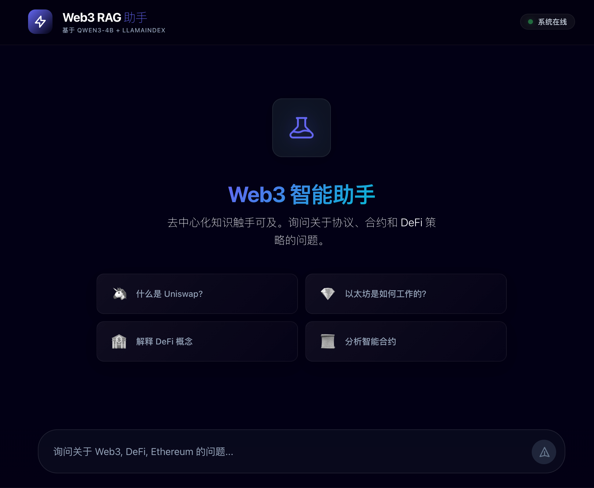
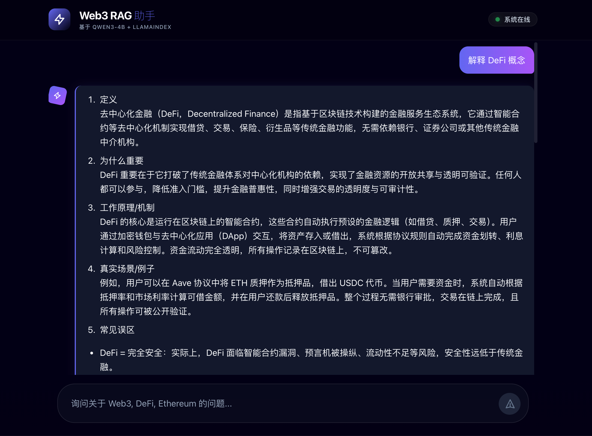
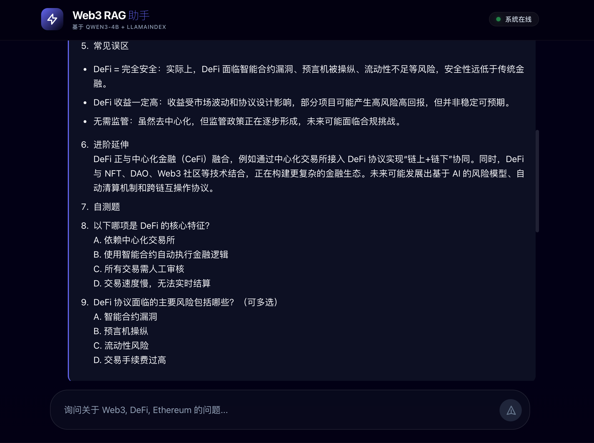
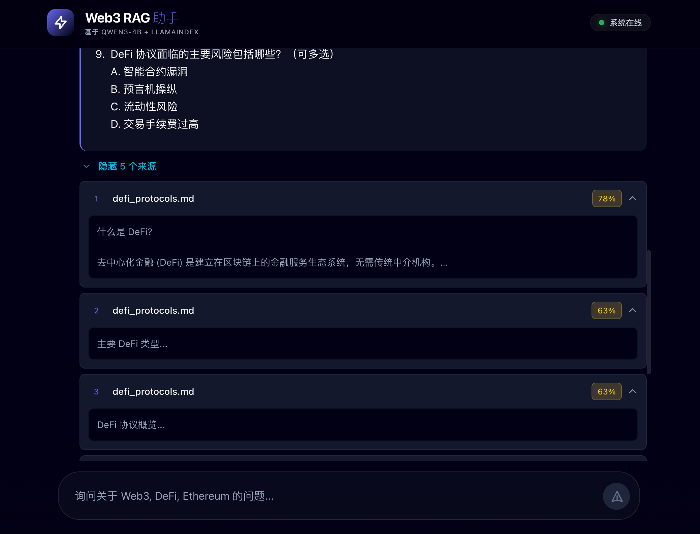

# Web3 RAG - 本地化智能问答系统

> **一句话简介**：完全离线运行的 Web3 领域 RAG 智能问答系统，支持 LoRA 微调和现代化 Web 界面。

---

## 项目背景与解决的问题

### 背景

Web3（去中心化网络）领域知识复杂、更新快速，涵盖区块链、智能合约、DeFi 协议、NFT、DAO 等众多概念。对于开发者、投资者和研究人员来说，快速获取准确、专业的 Web3 知识是一大挑战：

- **知识碎片化**：资料分散在白皮书、技术文档、社区讨论中
- **门槛高**：专业术语多，新手难以入门
- **时效性强**：协议更新频繁，信息容易过时
- **隐私顾虑**：使用云端 AI 服务可能泄露敏感查询内容

### 解决方案

**Web3 RAG** 是一个完全本地化的智能问答系统，结合检索增强生成（RAG）技术和大语言模型微调，专门为 Web3 领域打造：

1. **完全离线**：无需调用 OpenAI/Claude 等云端 API，保护隐私
2. **领域专精**：通过 LoRA 微调，模型深度理解 DeFi、智能合约等专业知识
3. **知识可控**：用户可自定义知识库，添加最新协议文档
4. **教学导向**：回答结构化，适合学习和研究

---

## 核心功能列表

### Phase 1: RAG 智能问答

| 功能 | 描述 |
|------|------|
| **文档索引** | 支持 PDF/Markdown/TXT 格式，自动分块、向量化存储 |
| **语义检索** | 基于 Qwen3-Embedding-4B 的高质量向量检索 |
| **智能回答** | 结合检索上下文，生成准确、结构化的答案 |
| **来源追溯** | 展示回答依据的原始文档片段和相似度分数 |
| **持久化索引** | 向量库本地持久化，秒级启动 |

### Phase 2: LoRA 微调

| 功能 | 描述 |
|------|------|
| **数据生成** | 自动从知识库生成 Q&A 训练数据 |
| **LoRA 训练** | 低资源高效微调，仅需 12GB 显存 |
| **热加载** | 微调适配器动态加载，无需合并权重 |
| **效果评估** | 端到端对比测试，验证微调效果 |

### Phase 3: Web 界面

| 功能 | 描述 |
|------|------|
| **现代化 UI** | Next.js + TailwindCSS，暗色 Web3 主题 |
| **流式响应** | 打字机效果，实时展示生成过程 |
| **来源卡片** | 可折叠展示引用来源，支持相似度分数 |
| **响应式设计** | 适配桌面和移动端 |

---

## 目标用户与使用场景

### 目标用户

| 用户群体 | 典型需求 |
|----------|----------|
| **Web3 开发者** | 快速查询 Solidity 语法、合约安全最佳实践 |
| **DeFi 研究员** | 深入理解 Uniswap/Aave/Compound 等协议机制 |
| **区块链投资者** | 学习 DeFi 概念、评估项目风险 |
| **高校师生** | 区块链课程辅助教学和学习 |
| **企业内部** | 构建私有知识库，保护敏感信息 |

### 使用场景

1. **协议研究**："什么是 Uniswap V3 的集中流动性？它如何提高资本效率？"
2. **安全审计**："Solidity 中重入攻击的原理是什么？如何防范？"
3. **概念学习**："用通俗语言解释什么是 MEV（最大可提取价值）"
4. **技术开发**："如何在 Hardhat 中部署 ERC-20 代币合约？"

---

## AI 与 Web3 的使用方式与价值点

### AI 技术栈

| 组件 | 技术 | 价值 |
|------|------|------|
| **LLM 推理** | LlamaFactory + Qwen3-4B | 本地推理，零延迟调用 |
| **Embedding** | Qwen3-Embedding-4B | 2560 维高质量语义向量 |
| **RAG 框架** | LlamaIndex | 成熟的检索增强生成 |
| **微调方法** | LoRA (PEFT) | 低资源高效适配 |

### Web3 知识覆盖

- **区块链基础**：共识机制、Gas 费用、Layer2 扩容
- **DeFi 协议**：Uniswap、Aave、Compound、Curve、MakerDAO
- **智能合约**：Solidity 语法、安全漏洞、审计实践
- **高级概念**：MEV、跨链桥、预言机、闪电贷

### 核心价值

1. **数据主权**：知识库完全本地化，企业和个人掌握数据所有权
2. **隐私保护**：查询内容不上传云端，适合敏感场景
3. **可定制性**：用户可添加自己的文档，构建专属知识库
4. **离线可用**：一次部署，永久使用，不依赖网络

---

## 技术栈

| 组件 | 技术 |
|------|------|
| **LLM 框架** | LlamaFactory 0.9.5 |
| **RAG 框架** | LlamaIndex 0.11.23 |
| **LLM 模型** | Qwen3-4B-Instruct |
| **Embedding 模型** | Qwen3-Embedding-4B |
| **向量数据库** | Chroma (LlamaIndex 内置) |
| **后端 API** | FastAPI + Uvicorn |
| **前端 UI** | Next.js 14 + TypeScript + TailwindCSS |
| **微调方法** | LoRA (PEFT) |

---

## 快速开始

> 详细运行说明请参阅 [RUN.md](./RUN.md)

### 一键启动 (AutoDL)

```bash
# 启动所有服务（含 LlamaFactory API）
START_LLM=1 bash /root/autodl-tmp/TheWeb3/start_all.sh

# 访问 Web 界面
# AutoDL: https://<autodl-host>:6006/web
# 本地: http://127.0.0.1:3000/web
```

### 手动启动

```bash
cd /root/autodl-tmp/TheWeb3/web3_rag

# 1. 启动 LLM API (终端 1)
llamafactory-cli api configs/api_server.yaml

# 2. 启动后端 API (终端 2)
python -m uvicorn app.main:app --host 0.0.0.0 --port 8080

# 3. 启动前端 (终端 3)
cd frontend && npm run dev
```

---

## 项目结构

```
TheWeb3/
├── LLaMA-Factory/           # LLM 微调框架 (子模块)
├── web3_rag/                # 主应用
│   ├── app/                 # FastAPI 后端
│   ├── frontend/            # Next.js 前端
│   ├── src/                 # RAG 核心模块
│   ├── scripts/             # 运行脚本
│   ├── configs/             # 配置文件
│   ├── data/                # 知识库与训练数据
│   └── models/              # 本地模型 (gitignored)
├── README.md                # 本文件
├── DESIGN.md                # 设计文档
├── RUN.md                   # 运行说明
├── HIGHLIGHTS.md            # 技术亮点
├── PRD.md                   # 产品需求文档
└── AGENTS.md                # AI 开发指南
```

---

## 相关文档

| 文档 | 说明 |
|------|------|
| [DESIGN.md](./DESIGN.md) | 系统架构设计、模块划分、关键流程 |
| [RUN.md](./RUN.md) | 环境依赖、安装步骤、启动命令 |
| [HIGHLIGHTS.md](./HIGHLIGHTS.md) | 技术亮点与创新说明 |
| [PRD.md](./PRD.md) | 产品需求文档 |
| [AGENTS.md](./AGENTS.md) | AI 开发指南 |

---

## 演示视频

📺 **查看完整演示视频**: [docs/demo/demo.mov](./docs/demo/demo.mov)

> 视频文件较大 (149MB)，使用 Git LFS 存储。克隆仓库后可直接播放，或在 GitHub 页面点击下载。

**包含内容**：
- 系统启动与初始化
- Web3 知识问答演示
- 来源追溯功能展示
- 流式响应效果

---

## 演示截图

### 首页界面

*Web3 RAG 助手首页，提供快捷问题入口*

### 智能问答

*结构化的 DeFi 概念解释，包含定义、重要性、机制等*

### 教学式回答

*包含常见误区、进阶延伸、自测题的教学式回答*

### 来源追溯

*展示回答依据的知识库文档和相似度分数*

---

## 贡献者

- 项目开发：刘青沅

---

## 许可证

本项目采用 [Apache-2.0 License](./LICENSE) 开源协议。

使用本项目涉及的模型时，请遵循相应模型的许可证：
- [Qwen License](https://huggingface.co/Qwen/Qwen3-4B-Instruct/blob/main/LICENSE) (Qwen3-4B-Instruct, Qwen3-Embedding-4B)
- [LlamaFactory License](https://github.com/hiyouga/LLaMA-Factory/blob/main/LICENSE) (Apache-2.0)
