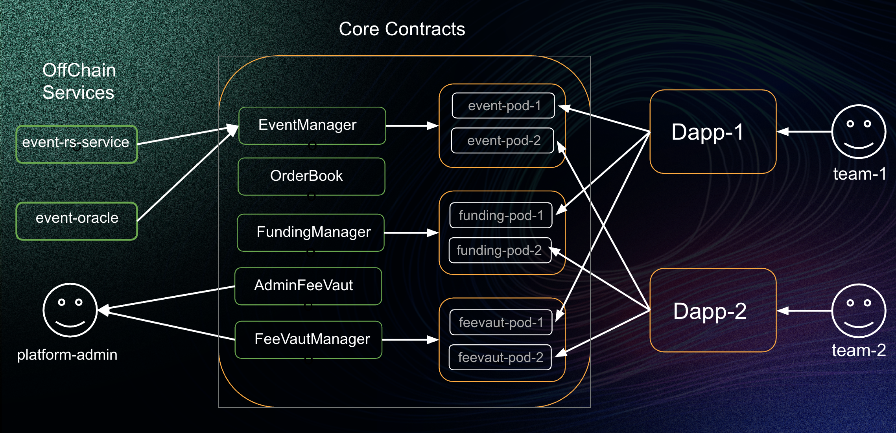

# Decentralized Prediction Market BaaS Platform

## 1. Overview
This is a fully decentralized event prediction market BaaS (Blockchain-as-a-Service) platform designed to help developers and project teams rapidly build their own dedicated prediction markets.
It enables complete separation of events, funds, and platform fees through a modular smart contract architecture.

In one sentence: Projects =Decentralization + Modular Design + Multi-Chain Support + AI Agent–Powered Prediction Market Builder

Key features include:
- Built entirely on smart contracts
- Transparent events, funds, and rules
- Automated settlement with verifiable trustlessness
- Low barrier to user participation

## 2.Platform Introduction

Platform provides a complete, production-ready technical framework. Developers can deploy a fully functional prediction market Dapp within seconds.

Core capabilities include:

- Decentralized fund custody (managed automatically by smart contracts)
- Isolated event architecture (independent markets without cross-impact)
- AI Agent development toolkit for rapid creation of custom prediction markets
- Multi-Chain support, compatible with major blockchain ecosystems

## 3.System Architecture
[](https://github.com/roothash-pay/event-contracts)

### 3.1.Smart Contract Architecture
The Platform system is fully modular and Pod-based, allowing horizontal scalability and Platform isolation:

#### Event Creation & Management 
- EventManager: Manages event lifecycle and distributes event updates.
- EventPod: Dedicated event-processing pods that independently handle different event groups.

#### Funding Management & Settlement

- FundingManager: Manages market pools, settlement logic, and reward distribution.
- FundingPod: Pool-level contract pods for fund tracking and automated settlement.

#### Fee & Revenue Management

- FeeVaultManager: Manages fee accumulation for each project or market.
- FeeVaultPod: Independent fee pools for Platform isolation.

#### Decentralized Order Matching

- OrderBookManager: Manages user positions and order states.
- OrderBookPod: Order book pods operating independently for scalability and isolation.

#### Admin-Level Fee Custody
- AdminFeeVault: Stores aggregated platform-level administrative fees and enables revenue sharing.

## 4.Summary

Platform delivers a modular, decentralized, and developer-friendly framework for building scalable prediction markets.
With smart contract–based automation, multi-chain deployment capability, and AI-powered generation tools, Platform drastically lowers the barrier for launching secure, transparent, and customizable prediction market applications.

## 5.Usage

### 5.1.Build

```shell
$ forge build
```

### 5.2.Test

```shell
$ forge test
```

### 5.3.Format

```shell
$ forge fmt
```

### 5.4.Gas Snapshots

```shell
$ forge snapshot
```

### 5.5.Deploy

```shell
```
