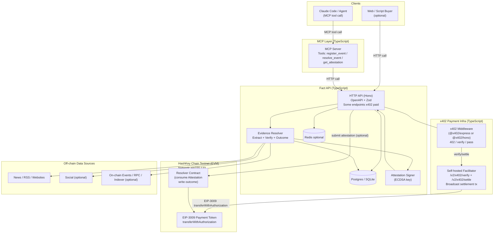

# Architecture Diagram

```mermaid
flowchart TB
  %% ===== Clients =====
  subgraph Clients["Clients"]
    AI["Claude Code / Agent\n(MCP tool call)"]
    User["Web / Script Buyer\n(optional)"]
  end

  %% ===== MCP =====
  subgraph MCP["MCP Layer (TypeScript)"]
    MCPServer["MCP Server\nTools: register_event / resolve_event / get_attestation"]
  end

  %% ===== Fact Layer =====
  subgraph FactLayer["Fact API (TypeScript)"]
    APIGW["HTTP API (Hono)\nOpenAPI + Zod\nSome endpoints x402 paid"]
    Resolver["Evidence Resolver\nExtract + Verify + Outcome"]
    DB[(Postgres / SQLite)]
    Cache[(Redis optional)]
    Attestor["Attestation Signer\n(ECDSA key)"]
  end

  %% ===== x402 =====
  subgraph X402["x402 Payment Infra (TypeScript)"]
    X402MW["x402 Middleware\n(@x402/express or @x402/hono)\n402 / verify / pass"]
    Facilitator["Self-hosted Facilitator\n/v2/x402/verify + /v2/x402/settle\nBroadcast settlement tx"]
  end

  %% ===== Chain =====
  subgraph Chain["HashKey Chain Testnet (EVM)\nNetwork: eip155:133"]
    Token["EIP-3009 Payment Token\ntransferWithAuthorization"]
    PM["Resolver Contract\n(consume Attestation\nwrite outcome)"]
  end

  %% ===== Data Sources =====
  subgraph Sources["Off-chain Data Sources"]
    News["News / RSS / Websites"]
    Social["Social (optional)"]
    Onchain["On-chain Events / RPC / Indexer (optional)"]
  end

  %% ===== Flows =====
  AI -->|"MCP tool call"| MCPServer
  User -->|"HTTP call"| APIGW
  MCPServer -->|"HTTP call"| APIGW

  APIGW --> Resolver
  Resolver --> News
  Resolver --> Social
  Resolver --> Onchain

  APIGW --> DB
  APIGW --> Cache
  Resolver --> DB

  %% x402 paywall path
  APIGW --- X402MW
  X402MW -->|"verify/settle"| Facilitator
  Facilitator -->|"EIP-3009 transferWithAuthorization"| Token

  %% attestation path
  Resolver --> Attestor
  Attestor --> APIGW
  APIGW -->|"submit attestation (optional)"| PM

  PM --> Token
```

